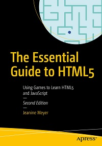

# Apress Source Code

This repository accompanies [*The Essential Guide to HTML5*](http://www.apress.com/9781484241547) by Jeanine Meyer (Apress, 2018).

[comment]: #cover

Download the files as a zip using the green button, or clone the repository to your machine using Git.

## Releases

Release v1.0 corresponds to the code in the published book, without corrections or updates.

## Contributions

See the file Contributing.md for more information on how you can contribute to this repository.

Knoledge you will find here:
Resume of the chapters and the knoledge explained:

## Chapert 01: Absolute basics of HTML.

## Chapter 02: The dice game

• Drawing on a canvas
• Random processing
• Game logic
• Form output

• Declare variables and use global variables to represent 
application state
• Write code to perform arithmetic operations
• Define and use programmer-defined functions
• Use several built-in features of JavaScript, including the Math.random
and Math.floor methods
• Use if and switch statements
• Create a canvas using an HTML element
• Draw rectangles and circles on canvas

## Chapter 03: Bouncing Ball

• Creating programmer-defined objects
• Using setInterval for animation
• Drawing images
• Accepting and validating form input
• Using buttons
• Using for loops
• Drawing with gradients
• Preloading images

• Using setInterval to set up a timing event for the animation and clearInterval to top the event
• Validating form input
• Using programmer-defined functions to reposition a circle or an image horizontally and vertically to simulate a bouncing ball
• Testing for virtual collisions
• Drawing rectangles, images, and circles, including gradients for the coloring
• Using button elements
• Ensuring downloading of image files
• Moving a video element
• Starting a video to comply with requirements for user participation
• Restarting a video

## Chapter 04: Cannonball and Slingshot

• Maintaining a list of objects to draw on the screen
• Rotating objects drawn on the screen
• Mouse drag-and-drop operations
• Calculations to simulate ballistic motion (effects of gravity) and collisions

• Programmer-defined objects
• setInterval to set up a timing event for the animation, as was done  for the bouncing ball
• Building an array using the push method and using the array as a list  of what to display
• Modifying arrays using the splice method
• Using trig functions and transformations to rotate the cannon and  to resolve the horizontal and vertical velocities in the cannon and slingshot applications so as to simulate gravity
• Using a form for player input
• Handling mouse events (mousedown, mousemove, and mouseup), with 
addEventListener to obtain player input
• Drawing arcs, rectangles, lines, and images on a canvas

## Chapter 05: Memory Game

• Drawing polygons
• Placing text on the canvas
• Programming techniques for representing information
• Programming a pause
• Calculating elapsed time
• One method of shuffling a set of card objects

• Examples of programmer-defined functions and programmer defined objects
• How to draw polygons on the canvas using moveTo and lineTo along with Math trig methods
• Guidance on how to use a form to show information to players
• A method for drawing text with a specified font on the canvas
• Instructions about how to draw images on the canvas
• Using setTimeout to force a pause
• Employing Date objects to compute elapsed time
• The THIS key word in functions

## Chapter 06: Presidents Quiz:

• Creating HTML elements by code
• Responding to clicks of the mouse on specific elements and stopping 
responding to clicks of the mouse on specific elements
• Creating and accessing arrays
• Playing an audio clip and a video clip
• Checking player responses and preventing bad behavior

• Creating HTML during runtime using document.createElement, document.getElementById, and document.body.appendChild
• Setting up event handling for the mouse click event using addEventListener
• Removing event handling for the mouse click event using removeEventListener
• Changing the color of objects on the screen using code to change CSS settings
• Creating an array of arrays to hold the quiz content
• Using for loops for iterating over the array
• Using do-while loops to make a random choice of an unused question set
• Using substring for extracting strings to be used in the checking
• Turning a string into a number using the Number function
• Using video and audio elements for displaying video and audio encoded in formats acceptable by different browsers

## Chapter 07: Mazes

• Responding to mouse events
• Calculating collisions between circles and lines
• Responding to the arrow keys
• Form input
• Encoding, saving, decoding, and restoring information from local storage using try and catch to test whether coding is recognized
• Using join and split to encode and decode information
• Using javascript: in a button to invoke functions
• Radio buttons

